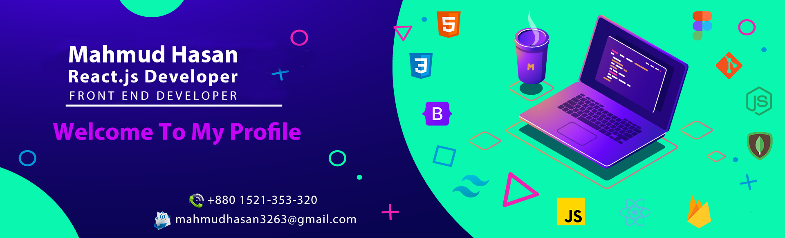

 

## 👋 Hello there! I'm Mahmud Hasan

- 🔭 I’m currently Seeking a job or internship to upgrade my skill as a junior web developer.
- 🌱 I’m currently learning Next.js with Material-UI 
- 👯 I’m looking to collaborate on open source projects.
- ⚡ I love to travels.

## Connect with me

## My Current Stats
 

  

## Technologies & Tools that I know

 

